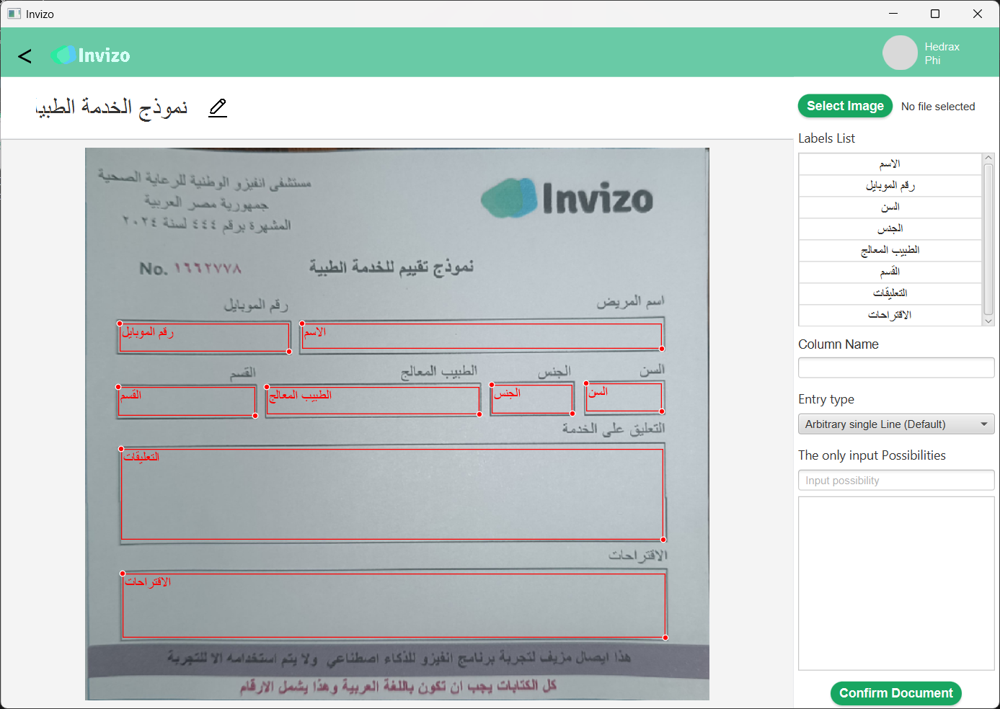
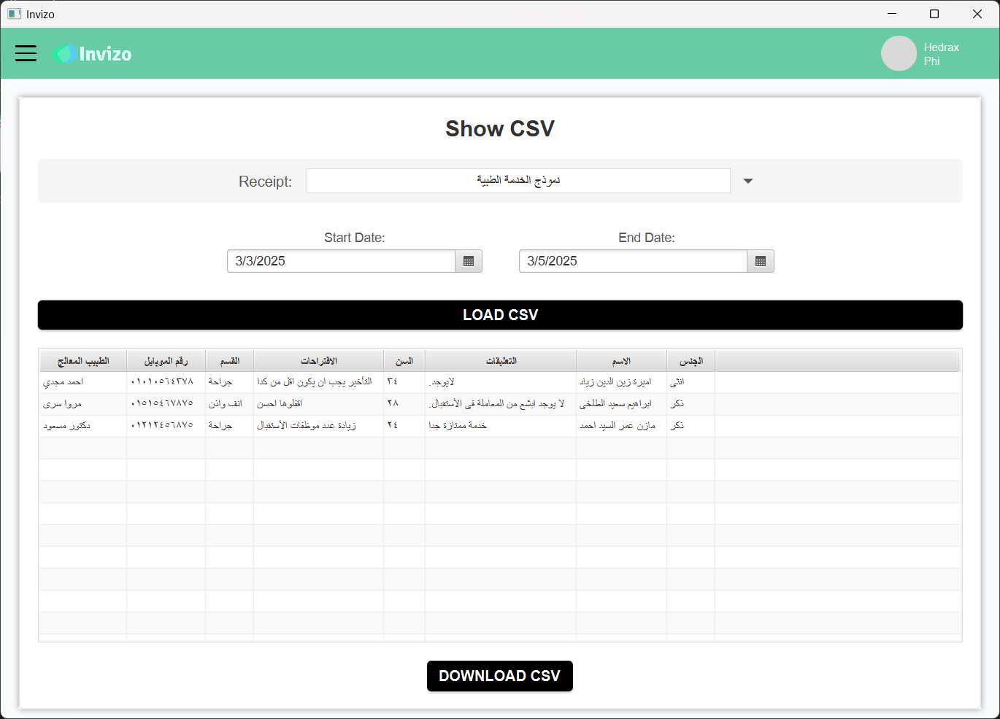
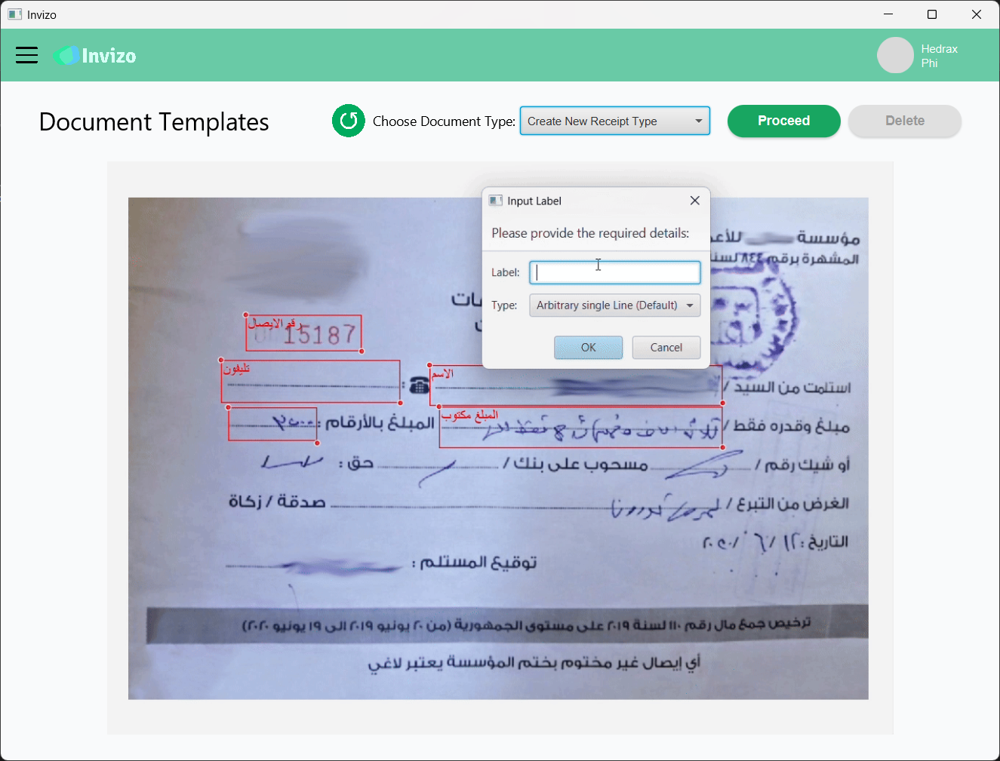
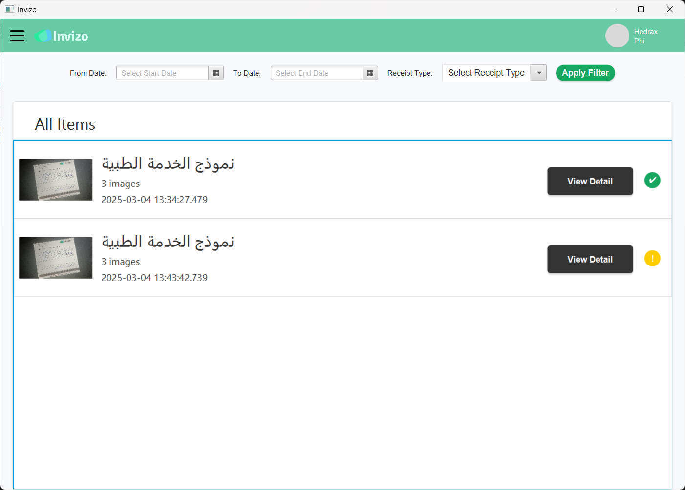
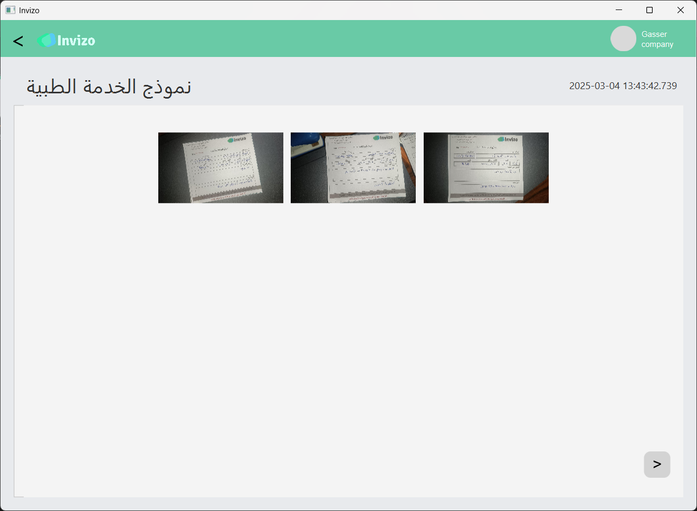
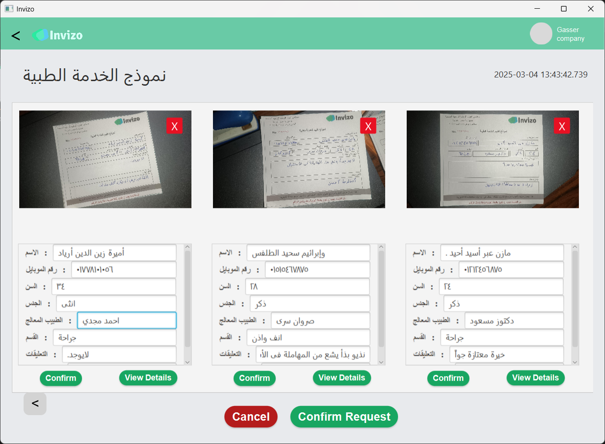
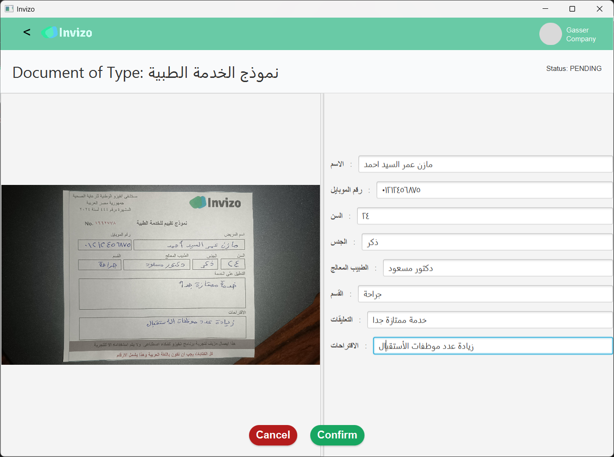
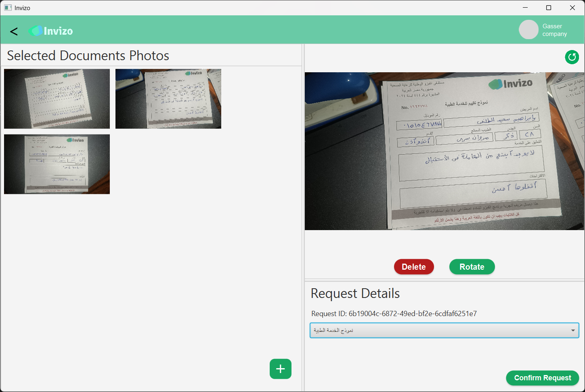

# Invizo - Arabic Handwritten OCR Solution  

  
    


## Overview  

This project provides an **end-to-end solution** for recognizing Arabic **handwritten, printed text, and Arabic numbers** from images and documents on a given template document. The system efficiently detects and extracts text using State-of-the-Art Real-Scene Text Detection Trained on detecting Arabic Handwritten Text. Powered by a highly capable Recognition Model trained on the synthesized dataset and publicly available handwritten datasets.

The **Application** integrates text detection and recognition models, making it a **practical solution for real-world OCR tasks** for batch recognition of documents of the same type.  

---
## Limitations
* The background underline of the text must be empty or with light ink for appropriate results
* The Current OCR Engine is unable to recognize handwritten styles with more complex and cursive nature
---

## Installation  

### 🔹 Windows Binaries (Recommended)  
Download and install the latest version using the **Invizo-OCR Windows Installer**:  

[Download Invizo-OCR Installer](https://github.com/Hedrax/Invizo-OCR/releases/download/v0.2-alpha/Invizo-Installer-Win.exe)  

Run the installer and follow the setup instructions.  

### 🔹 Manual Installation (Source Code)  
For setting up the project from source, ensure your machine environment includes **OpenCV Java .dll** and follow these steps:  

1. **Clone the Repository**  
   ```bash
   git clone [https://github.com/yourusername/arabic-ocr.git](https://github.com/Hedrax/Invizo-OCR)
   cd Invizo-OCR
   ```

2. **Set Up JavaFX and OpenCV**
  * Ensure you have **Java 11+** installed.
  * Download and set up the **JavaFX SDK** ([Download](https://gluonhq.com/products/javafx/)).  
  * Configure your **IDE** (IntelliJ IDEA, Eclipse, or VS Code) to include JavaFX libraries.  
  * Add **OpenCV Java .dll** to your system's library path.  

3. **Build and Run the Application**
   ```bash
   ./gradlew run
   ```
4. Once you run the application, the latest release's recognition and detection model will be downloaded automatically.

**Note:** If using Linux or Mac you will be required to extract the binary file from the python script in ```\src\main\python\``` and change the operation connection in ```\src\main\java\com\example\ocrdesktop\data\LocalAiService.java```

---
For More information about the approach and performance, check out the paper


## Citation  
```bibtex
@misc{waly2025invizoarabichandwrittendocument,
      title={Invizo: Arabic Handwritten Document Optical Character Recognition Solution}, 
      author={Alhossien Waly and Bassant Tarek and Ali Feteha and Rewan Yehia and Gasser Amr and Walid Gomaa and Ahmed Fares},
      year={2025},
      eprint={2502.05277},
      archivePrefix={arXiv},
      primaryClass={cs.CV},
      url={https://arxiv.org/abs/2502.05277}, 
}
```
## Demo Video  

**Google Drive:** [Invizo Demo Video](https://drive.google.com/file/d/1GX-wcYAgxVYYNR0FOgndyTK2_T_2AHqX/view?usp=drive_link)  


## Screenshots  

### Receipt Template
  

### Sheets  
  

### Document Type  
 

### All Requests  
  

### Detail Request 1  
  

### Detail Request 2  
  

 ### Detail Document  
  

### New Request  
  

